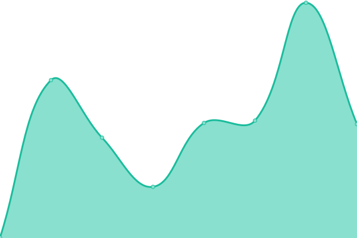
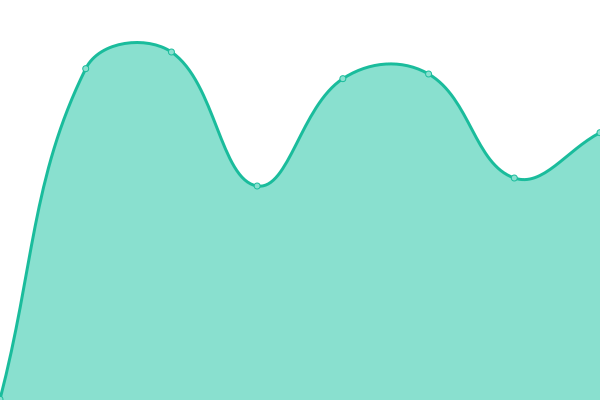

# [📈 Live Status](https://demo.upptime.js.org): <!--live status--> **🟧 Partial outage**

This repository contains the open-source uptime monitor and status page for [Upptime](https://upptime.js.org), powered by [Upptime](https://github.com/upptime/upptime).

With [Upptime](https://upptime.js.org), you can get your own unlimited and free uptime monitor and status page, powered entirely by a GitHub repository. We use [Issues](https://github.com/upptime/upptime/issues) as incident reports, [Actions](https://github.com/gnossis93/UPTIME-WEBECTIVE/actions) as uptime monitors, and [Pages](https://demo.upptime.js.org) for the status page.

<!--start: status pages-->
<!-- This summary is generated by Upptime (https://github.com/upptime/upptime) -->
<!-- Do not edit this manually, your changes will be overwritten -->
<!-- prettier-ignore -->
| URL | Status | History | Response Time | Uptime |
| --- | ------ | ------- | ------------- | ------ |
|  [Pattaya Interior Designer](https://www.pattayainteriordesigner.com/) | 🟩 Up | [pattaya-interior-designer.yml](https://github.com/gnosis93/UPTIME-WEBECTIVE/commits/HEAD/history/pattaya-interior-designer.yml) | 

 297ms
     
 | 

<a href="https://gnosis93.github.io/UPTIME-WEBECTIVE/history/pattaya-interior-designer">100.00%</a>
    

|  [And Burger](https://andburger.in.th/) | 🟩 Up | [and-burger.yml](https://github.com/gnosis93/UPTIME-WEBECTIVE/commits/HEAD/history/and-burger.yml) | 

 26004ms
     
 | 

<a href="https://gnosis93.github.io/UPTIME-WEBECTIVE/history/and-burger">83.55%</a>
    

|  [Webective](https://webective.com/) | 🟩 Up | [webective.yml](https://github.com/gnosis93/UPTIME-WEBECTIVE/commits/HEAD/history/webective.yml) | 

 259ms
     
 | 

<a href="https://gnosis93.github.io/UPTIME-WEBECTIVE/history/webective">100.00%</a>
    

|  [Contracts System](https://contracts.pattayainteriordesigner.com/) | 🟩 Up | [contracts-system.yml](https://github.com/gnosis93/UPTIME-WEBECTIVE/commits/HEAD/history/contracts-system.yml) | 

 901ms
     
 | 

<a href="https://gnosis93.github.io/UPTIME-WEBECTIVE/history/contracts-system">100.00%</a>
    

|  [Maps System](https://maps.pattayainteriordesigner.com/login/) | 🟩 Up | [maps-system.yml](https://github.com/gnosis93/UPTIME-WEBECTIVE/commits/HEAD/history/maps-system.yml) | 

 704ms
     
 | 

<a href="https://gnosis93.github.io/UPTIME-WEBECTIVE/history/maps-system">100.00%</a>
    

|  [portainer](https://portainer.webective.com/) | 🟩 Up | [portainer.yml](https://github.com/gnosis93/UPTIME-WEBECTIVE/commits/HEAD/history/portainer.yml) | 

 623ms
     
 | 

<a href="https://gnosis93.github.io/UPTIME-WEBECTIVE/history/portainer">100.00%</a>
    

|  [kurzus statging](https://kurzus.webective.com/) | 🟥 Down | [kurzus-statging.yml](https://github.com/gnosis93/UPTIME-WEBECTIVE/commits/HEAD/history/kurzus-statging.yml) | 

 460ms
     
 | 

<a href="https://gnosis93.github.io/UPTIME-WEBECTIVE/history/kurzus-statging">0.00%</a>
    

|  [kurzus production](https://kurzus.intellident.hu/) | 🟩 Up | [kurzus-production.yml](https://github.com/gnosis93/UPTIME-WEBECTIVE/commits/HEAD/history/kurzus-production.yml) | 

 1085ms
     
 | 

<a href="https://gnosis93.github.io/UPTIME-WEBECTIVE/history/kurzus-production">100.00%</a>
    

<!--end: status pages-->

[**Visit our status website →**](https://demo.upptime.js.org)

## 📄 License

- Powered by: [Upptime](https://github.com/upptime/upptime)
- Code: [MIT](./LICENSE) © [Upptime](https://upptime.js.org)
- Data in the `./history` directory: [Open Database License](https://opendatacommons.org/licenses/odbl/1-0/)
