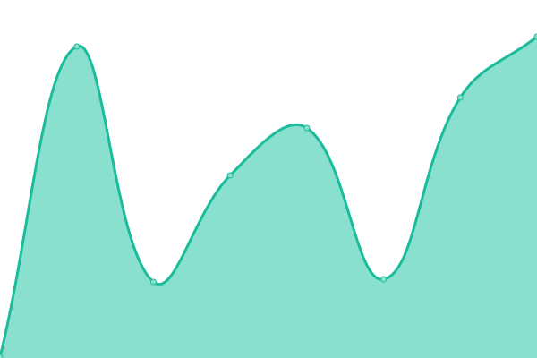

# [📈 Live Status](https://demo.upptime.js.org): <!--live status--> **🟧 Partial outage**

This repository contains the open-source uptime monitor and status page for [Upptime](https://upptime.js.org), powered by [Upptime](https://github.com/upptime/upptime).

With [Upptime](https://upptime.js.org), you can get your own unlimited and free uptime monitor and status page, powered entirely by a GitHub repository. We use [Issues](https://github.com/upptime/upptime/issues) as incident reports, [Actions](https://github.com/upptime/upptime/actions) as uptime monitors, and [Pages](https://demo.upptime.js.org) for the status page.

<!--start: status pages-->
<!-- This summary is generated by Upptime (https://github.com/upptime/upptime) -->
<!-- Do not edit this manually, your changes will be overwritten -->
<!-- prettier-ignore -->
| URL | Status | History | Response Time | Uptime |
| --- | ------ | ------- | ------------- | ------ |
|  [Hot Dog Condos](https://www.hotdogcondos.com/) | 🟥 Down | [hot-dog-condos.yml](https://github.com/gnosis93/UPTIME-APPSILION/commits/HEAD/history/hot-dog-condos.yml) | 

 0ms
     
 | 

<a href="https://demo.upptime.js.org/history/hot-dog-condos">0.00%</a>
    

|  [And Burger](https://andburger.in.th/) | 🟩 Up | [and-burger.yml](https://github.com/gnosis93/UPTIME-APPSILION/commits/HEAD/history/and-burger.yml) | 

 1383ms
     
 | 

<a href="https://demo.upptime.js.org/history/and-burger">100.00%</a>
    

|  [Forest Pool Villas Pattaya](https://forestpoolvillaspattaya.com/) | 🟥 Down | [forest-pool-villas-pattaya.yml](https://github.com/gnosis93/UPTIME-APPSILION/commits/HEAD/history/forest-pool-villas-pattaya.yml) | 

 0ms
     
 | 

<a href="https://demo.upptime.js.org/history/forest-pool-villas-pattaya">0.00%</a>
    

|  [AndBurger MONEY SYSTEM](https://money.hotdogcondos.com/) | 🟥 Down | [and-burger-money-system.yml](https://github.com/gnosis93/UPTIME-APPSILION/commits/HEAD/history/and-burger-money-system.yml) | 

 0ms
     
 | 

<a href="https://demo.upptime.js.org/history/and-burger-money-system">0.00%</a>
    

|  [Rough Dog](https://rough.dog/) | 🟥 Down | [rough-dog.yml](https://github.com/gnosis93/UPTIME-APPSILION/commits/HEAD/history/rough-dog.yml) | 

 0ms
     
 | 

<a href="https://demo.upptime.js.org/history/rough-dog">0.00%</a>
    

|  [Bill Bags](https://bills-bags.com/) | 🟥 Down | [bill-bags.yml](https://github.com/gnosis93/UPTIME-APPSILION/commits/HEAD/history/bill-bags.yml) | 

 1742ms
     
 | 

<a href="https://demo.upptime.js.org/history/bill-bags">99.22%</a>
    

|  [Webective](https://webective.com/) | 🟩 Up | [webective.yml](https://github.com/gnosis93/UPTIME-APPSILION/commits/HEAD/history/webective.yml) | 

 706ms
     
 | 

<a href="https://demo.upptime.js.org/history/webective">100.00%</a>
    

<!--end: status pages-->

[**Visit our status website →**](https://demo.upptime.js.org)

## 📄 License

- Powered by: [Upptime](https://github.com/upptime/upptime)
- Code: [MIT](./LICENSE) © [Upptime](https://upptime.js.org)
- Data in the `./history` directory: [Open Database License](https://opendatacommons.org/licenses/odbl/1-0/)
